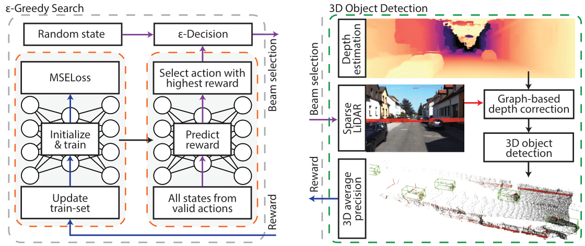

# End-To-End Optimization of LiDAR Beam Configuration
[**arXiv**]() |  [**IEEE Xplore**]()

This repository is the official implementation of the paper:

> **End-To-End Optimization of LiDAR Beam Configuration for 3D Object Detection and Localization**
>
> [Niclas Vödisch](https://vniclas.github.io/), [Ozan Unal](https://vision.ee.ethz.ch/people-details.MjA5ODkz.TGlzdC8zMjg5LC0xOTcxNDY1MTc4.html), [Ke Li](https://icu.ee.ethz.ch/people/person-detail.ke-li.html), [Luc Van Gool](https://vision.ee.ethz.ch/people-details.OTAyMzM=.TGlzdC8zMjQ4LC0xOTcxNDY1MTc4.html), and [Dengxin Dai](https://people.ee.ethz.ch/~daid/).
> 
> *To appear in RA-L.*

<p align="center">
  
</p>

If you find our work useful, please consider citing our paper:
```
to be added after publication
```

## 📔 Abstract

Pre-determined beam configurations of low-resolution LiDARs are task-agnostic, hence simply using can result in non-optimal performance.
In this work, we propose to optimize the beam distribution for a given target task via a reinforcement learning-based learning-to-optimize (RL-L2O) framework.
We design our method in an end-to-end fashion leveraging the final performance of the task to guide the search process.
Due to the simplicity of our approach, our work can be integrated with any LiDAR-based application as a simple drop-in module.
In this repository, we provide the code for the exemplary task of 3D object detection.


## 🏗️️ Setup

To clone this repository and all submodules run:
```shell
git clone --recurse-submodules -j8 git@github.com:vniclas/lidar_beam_selection.git
```

### ⚙️ Installation

To install this code, please follow the steps below:
1. Create a conda environment: `conda create -n beam_selection python=3.8`
2. Activate the environment: `conda activate beam_selection`
3. Install dependencies: `pip install -r requirements.txt`
4. Install cudatoolkit *(change to the used CUDA version)*: <br>
   `conda install cudnn cudatoolkit=10.2`
5. Install [spconv](https://github.com/traveller59/spconv#install) *(change to the used CUDA version)*: <br>
   `pip install spconv-cu102`
6. Install [OpenPCDet](https://github.com/open-mmlab/OpenPCDet) *(linked as submodule)*: <br>
   `cd third_party/OpenPCDet && python setup.py develop && cd ../..`
7. Install [Pseudo-LiDAR++](https://github.com/mileyan/Pseudo_Lidar_V2) *(linked as submodule)*: <br>
   `pip install -r third_party/Pseudo_Lidar_V2/requirements.txt` <br>
   `pip install pillow==8.3.2`  *(avoid runtime warnings)*

### 💾 Data Preparation

1. Download [KITTI 3D Object Detection dataset](http://www.cvlibs.net/datasets/kitti/eval_object.php?obj_benchmark=3d) and extract the files: 
   1. Left color images `image_2`
   2. Right color images `image_3`
   3. Velodyne point clouds `velodyne`
   4. Camera calibration matrices `calib`
   5. Training labels `label_2`
2. Predict the depth maps:
   1. Download [pretrained model (training+validation)](https://github.com/mileyan/Pseudo_Lidar_V2#pretrained-models)
   2. Generate the data:
   ```shell
   cd third_party/Pseudo_Lidar_V2  
   python ./src/main.py -c src/configs/sdn_kitti_train.config \
   --resume PATH_TO_CHECKPOINTS/sdn_kitti_object_trainval.pth --datapath PATH_TO_KITTI/training/ \
   --data_list ./split/trainval.txt --generate_depth_map --data_tag trainval \
   --save_path PATH_TO_DATA/sdn_kitti_train_set
   ```
   **Note:** Please adjust the paths `PATH_TO_CHECKPOINTS`, `PATH_TO_KITTI`, and `PATH_TO_DATA` to match your setup.
3. Rename `training/velodyne` to `training/velodyne_original`
4. Symlink the KITTI folders to PCDet:
   * `ln -s PATH_TO_KITTI/training third_party/OpenPCDet/data/kitti/training`
   * `ln -s PATH_TO_KITTI/testing third_party/OpenPCDet/data/kitti/testing`


## 🏃 Running 3D Object Detection

1. Adjust paths in [`main.py`](main.py). Further available parameters are listed in [`rl_l2o/eps_greedy_search.py`](rl_l2o/eps_greedy_search.py) and can be added in `main.py`.
2. Adjust the number of epochs of the 3D object detector in *(we used 40 epochs)*:
   - [`object_detection/compute_reward.py`](object_detection/compute_reward.py) --> above the class definition
   - [`third_party/OpenPCDet/tools/cfgs/kitti_models/pointpillar.yaml`](third_party/OpenPCDet/tools/cfgs/kitti_models/pointpillar.yaml) --> search for `NUM_EPOCHS` <br>
   **Note:** If you use another detector, modify the respective configuration file.
3. Adjust the training scripts of the utilized detector to match your setup, e.g., [`object_detection/scripts/train_pointpillar.sh`](object_detection/scripts/train_pointpillar.sh).
5. Initiate the search: `python main.py` <br>
   **Note:** Since we keep intermediate results to easily re-use them in later iterations, running the script will create a lot of data in the `output_dir` specified in [`main.py`](main.py). You might want to manually delete some folders from time to time. 


## 🔧 Adding more Tasks

Due to the design of the RL-L2O framework, it can be used as a simple drop-in module for many LiDAR applications.
To apply the search algorithm to another task, just implement a custom `RewardComputer`, e.g., see [`object_detection/compute_reward.py`](object_detection/compute_reward.py).
Additionally, you will have to prepare a set of features for each LiDAR beam.
For the KITTI 3D Object Detection dataset, we provide the features as presented in the paper in [`object_detection/data/features_pcl.pkl`](object_detection/data/features_pcl.pkl).


## 👩‍⚖️ License

<a rel="license" href="http://creativecommons.org/licenses/by-nc/4.0/"></a><br>
This software is made available for non-commercial use under a [Creative Commons Attribution-NonCommercial 4.0 International License](LICENSE). A summary of the license can be found on the [Creative Commons website](http://creativecommons.org/licenses/by-nc/4.0).
